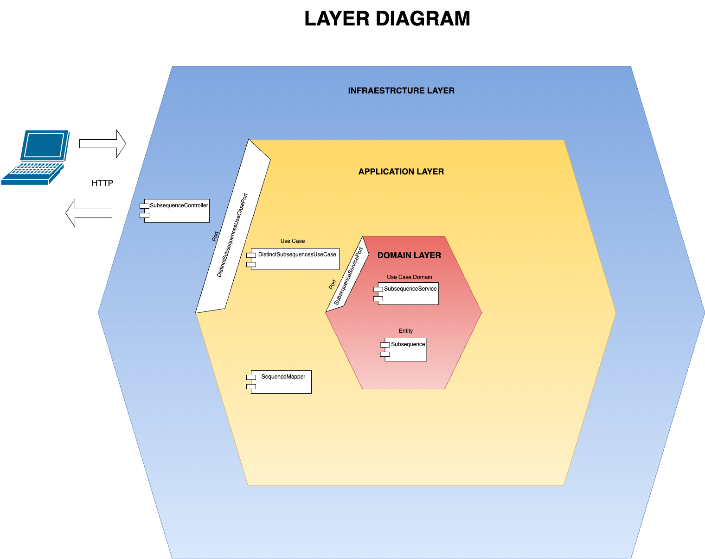

# Pattern Engine

This project implements a dynamic programming algorithm to efficiently calculate the number of common subsequences between two strings.
### Features.

- `url LOCAL`: http://localhost:8080/pattern-engine/v1
- `url AWS`: http://67.202.55.154:8080/pattern-engine/v1
- `Context`: pattern-engine
- `Code building tool`: Gradle
- `Framework`: Spring boot 3.3.2
- `Language`: Java 17
- `URL swagger LOCAL`: http://localhost:8080/pattern-engine/v1/swagger-ui/index.html
- `URL swagger AWS`: http://67.202.55.154:8080/pattern-engine/v1/swagger-ui/index.html
  

# Available methods.

### - Processing Payment:

LOCAL:
- `POST`: http://localhost:8080/pattern-engine/v1/subsequences

AWS:
- `POST`: http://67.202.55.154:8080/pattern-engine/v1/subsequences


Request:

```json
{
   "source":"rabbbit",
   "target":"rabbit"
}
```

Response success: Http-Code: 200

```json
{
   "subsequence": "rabbit",
   "number_subsequences": 3
}
```

# ¿How to run the program?

### STEPS IN CLOUD COMPUTING
- From postman consume the following REST services:

AWS:
- `POST`: http://67.202.55.154:8080/pattern-engine/v1/subsequences

The collection is located in the following project path:

```
./src/main/resources/collections/pattern-engine-aws.postman_collection.json
```

### STEPS IN DOCKER:

1. The application is deployed on Docker, Docker must be installed on the local machine and the
   following commands should be executed to create the image and deploy it on the container:

    - docker build -t pattern-engine .
    - docker run -d -p 8080:8080 pattern-engine

2. The Postman collection is attached to all endpoints in the mail so it can be downloaded and used
   to make the corresponding requests.

### STEPS IN LOCAL:

- Clone the project from the following path using the 'git
  clone: https://github.com/angiekroll/pattern-engine-.git
- Import the project from your IDE in this case intellij
- Compile the project
- Run
- Tester Potsman:
    
    `POST`: http://localhost:8080/pattern-engine/v1/subsequences

- The collection is located in the following project path:

```
./src/main/resources/collections/pattern-engine-local.postman_collection.json
```


# LAYER DIAGRAM:



- The diagram is located in the following project path:

```
./src/main/resources/diagram/Layer-diagram.drawio
```


